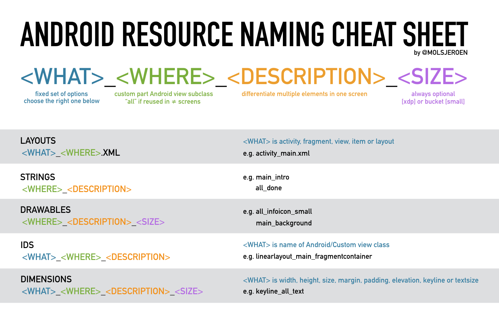

# Code Style and Naming Conventions OpenLab Perú

## Naming

If a source file contains only a single top-level class, the file name should reflect the case-sensitive name plus the .kt extension. Otherwise, if a source file contains multiple top-level declarations, choose a name that describes the contents of the file.

```sh
// MyClass.kt
class MyClass { }
```

```sh
// Map.kt
fun <T, O> Set<T>.map(func: (T) -> O): List<O> = // …
fun <T, O> List<T>.map(func: (T) -> O): List<O> = // …
```

## Formatting

### Braces

Braces are required for any if, for, when branch, do and while statments, even when the body is empty or contains a single statement.

```sh
if (string.isEmpty())
    return  // WRONG

if (string.isEmpty()) {
    return  // Okay
}
```

### Non-empty blocks

Braces follow the Kernighan and Ritchie style ("Egyptian brackets") for nonempty blocks and block-like constructs:

- No line break before the opening brace.
- Line break after the opening brace.
- Line break before the closing brace.
- Line break after the closing brace, only if that brace terminates a statement or terminates the body of a function, constructor, or named class. For example, there is no line break after the brace if it is followed by else or a comma.

```sh
return Runnable {
    while (condition()) {
        foo()
    }
}

return object : MyClass() {
    override fun foo() {
        if (condition()) {
            try {
                something()
            } catch (e: ProblemException) {
                recover()
            }
        } else if (otherCondition()) {
            somethingElse()
        } else {
            lastThing()
        }
    }
}
```

### Expresions

An if/else conditional that is used as an expression may omit braces only if the entire expression fits on one line.

```sh
val value = if (string.isEmpty()) 0 else 1  // Okay

val value = if (string.isEmpty())  // WRONG
    0
else
    1

val value = if (string.isEmpty()) { // Okay
    0
} else {
    1
}
```

### Identation

Each time a new block or block-like construct is opened, the indent increases by four spaces. When the block ends, the indent returns to the previous indent level. The indent level applies to both code and comments throughout the block.

## XML Naming Convention

All resource names follow a simple convention:


In the following table it will be explained how to use correctly this cheatsheet:



For the ID's we should use the short name for the layout or view that we are referencing, i.e.:

- tv_main_title
- btn_main_description
